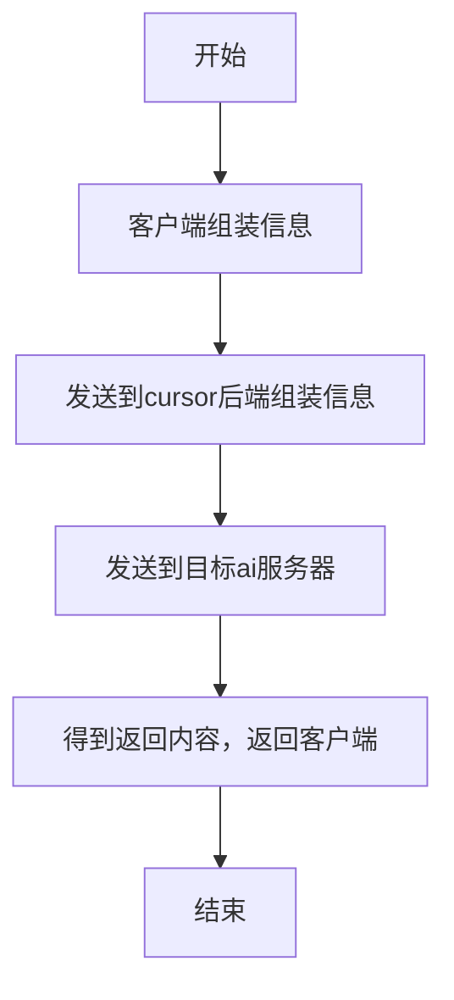

作为一个重度vibe coding患者，我得了一种写代码就犯困的病。

<!-- more -->

## 为什么会有这样一个项目？

正式开始之前，先看看我的cursor支付情况

再往前就更多了，于是我在三月份暂停了一部分的支付，转为吹到了天上的claude code cli（三方key，便宜耐造，公司似乎也是这样的，狠狠地薅资本主义羊毛啊！）。  

但是发现，身为一个前端，我太依赖多模态的能力了，cli要使用多模态，我还需要知道文件路径，先复制到本地，没有浏览器工具，diff只能看片面，无法有效引用上下文甚至行间上下文，写代码像是看黑盒一样，等等问题。  

遂转向codex app（不用claude desktop 是因为a社封号，搞不定），至少是拥有了一定的可视化能力。但是某些问题还是没有改变，比如付费还是很贵，比如还是没有codemap，codeindex等能力，比如基于上下文的提示词补全等。  

遂放弃，改为使用codex/claude code cli + cursor，体感仍一般。那么既然cursor这么好用，有没有一种办法既能使用三方key，又能用cursor丝滑的ai嵌入能力呢？有的兄弟，有的。  

总所周知，cursor支持一切 openai标准接口格式的自定义请求，setting->model->apikyes可见，在此处填入你从类openai获取的key，并修改baseUrl，即可使得除auto和claude之外的请求，都走到你的url，使用你自己的额度。

背景如上，开始实行。

## 通信机制

先说一下cursor得通信机制：

所以，我们的baseUrl收到消息一定是从cursor服务器来的，就需要一个https的域名，而非ip，这是必要条件，否则请求会直接截断。  

cursor目前使用的仍然是早期的/v1/chat/complete端口，而非当前的/response端口，所以你自己的服务（或者三方服务）一定要支持接收/v1/chat/complete。  

流式请求和响应，这个不用多说了。

基于以上三点，考虑到目前市面上的三方服务，几乎无法直接接收cursor的请求（封装了tools，message等），我直接写了一个服务用于转换，[github地](https://github.com/lljl500220/openai-compat-shim)，仅供参考。

内容核心就是获取到cursor的请求，做拆解，归一化，合并等。代码比较简单，让ai大人看看就知道了。

## 尚未解决的问题

目前发现，cursor对于多模态，无法直接使用baseUrl替代，其他所有的tools均可以使用。故只要不主动塞图给他，而是让他基于code的任务，和直接的cursor体验无任何区别。非要用多模态怎么办？反正都是要开pro的，直接换claude模型啊！反正额度不用白不用。

服务受限于你的三方key，比较看上游脸色，但是用几十块换两千块，我个人还是乐意的。下面是我十天的使用量，至少不用担心钱突然不见了。

具体的实施方案，我在仓库readme有详细说明，希望能帮助到你我的朋友～（馕言文语气）